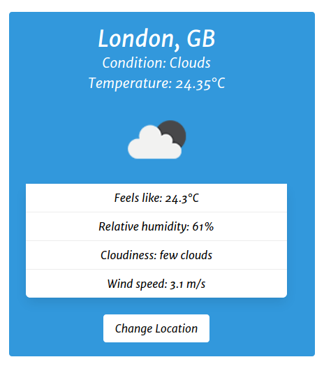

# Simple Weather

This is a simple weather JavaScript app that uses the [OpenWeather API](https://openweathermap.org/api).

## Screenshot

## Prerequisites

Before you begin, ensure you have met the following requirements:
To use it, you have to register foa an API key at [OpenWeather](https://openweathermap.org/api) 

## Using Simple Weather

To use Simple Weather, follow these steps:
* Clone this repo
* Insert your API key 
* Run index.html

## Contributing to Simple Weather
To contribute to simple-weather, follow these steps:

1. Fork this repository.
2. Create a branch: `git checkout -b <branch_name>`.
3. Make your changes and commit them: `git commit -m '<commit_message>'`
4. Push to the original branch: `git push origin simple-weather/<location>`
5. Create the pull request.

Alternatively see the GitHub documentation on [creating a pull request](https://help.github.com/en/github/collaborating-with-issues-and-pull-requests/creating-a-pull-request).

## Maintainer & Contributors
* [@guinuxbr](https://github.com/guinuxbr)

## Contact
If you want to contact me you can send an email to guinuxbr@gmail.com.

## License
This project uses the following license: [GNU GPLv3](https://www.gnu.org/licenses/gpl-3.0.html).
